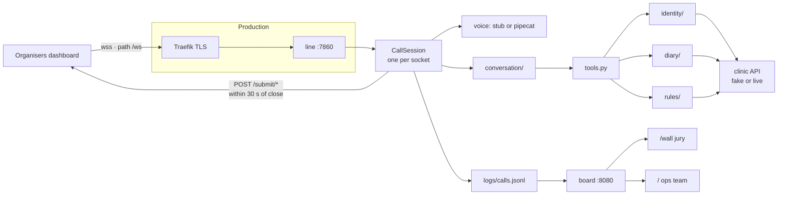
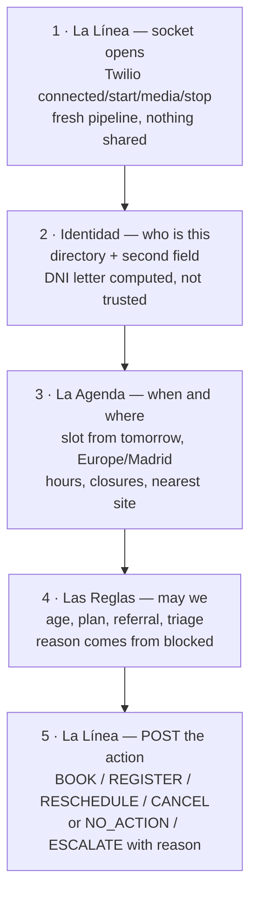
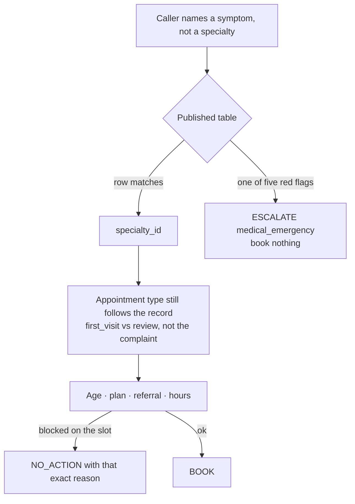

# Architecture — how Vortex is wired

Living picture of the system. Read this before you write code. **If a change
moves infra, routing, a case, a submit verb, or a lane boundary, update this
file and the diagrams in `docs/index.html` in the same change.** The HTML is
the team view (Spanish). This file is the source (English).

Open status of the 18 problems is the Friday 18 September snapshot. Check the
Problems page before you treat a case as open.

## The system

Organisers dial our socket. We never dial out. One fresh pipeline per
connection. The action we POST is the only thing the leaderboard scores.

**Endpoint to paste (scheme `wss://`, path `/ws` included):**

- Production: `wss://line.vortex.jferreiros.com/ws` — until DNS exists,
  `wss://line.203.0.113.20.sslip.io/ws`
- Laptop: `make run` then `make tunnel` → `wss://<ngrok-host>/ws`

Deploy of the socket: `deploy/deploy.sh`. Detail: `docs/deploy.md`.
Local still uses `make run` / `make board`. Missing keys switch to fake
clinic + stub voice; `GET /health` says which mode is up.

Board: `/wall` is public. `/`, `/evals` and `/bench` take
`VORTEX_OPS_PASSWORD` in production. Public wall:
`https://vortex.203.0.113.20.sslip.io/wall`.

## A call through the lanes

La Conversación wraps the whole call (listen, speak, barge-in, 3 min cap).
The other four lanes are steps.

Tools go through `vortex/tools.py` into the lane. Each function is
`async def name(ctx, args) -> typed result`. A tool returns data or a typed
`Rejection`. Never a sentence for the model to interpret. The `reason` a tool
returns is the `reason` we submit.

Ids are never guessed: `patient_id` from `/directory`, `appointment_id` from
`/patients/{id}/appointments`, `appointment_type_id` from `/availability`.

## How we route

Triage is a **lookup** on the published symptom table, not clinical
judgement. Full table: `.claude/skills/the-challenge/problems.md` §10 and
`evals/logic/cases/triage.yaml`.

Red flags (escalate, never a calendar): chest tightness + breathless; face
droop / arm weak / slurred speech; sudden cannot breathe; bleeding that will
not stop after ten minutes of pressure; head bang + confused and vomiting.

Referral-required specialties are kept out of triage cases. Language
constrains a booking only in problem 11.

## The 18 cases

Binary per case. The POST list matches one accepted outcome, or it fails.
Silence scores the same as a fail. `points = pass fraction × weight`. Four
private cases per scored problem.

| # | `problem_id` | pts | What must come back | Lane | Trap |
| --- | --- | ---: | --- | --- | --- |
| 1 | `simple_booking` | 1 | BOOK earliest from tomorrow | Identidad + Agenda | Same-day is never accepted |
| 2 | `switchboard` | — | Problem 1 on every line | La Línea | 5 / 10 / 20 at once; Run All never dials it |
| 3 | `doctor_and_site` | 2 | BOOK that provider+site, or NO_ACTION | Agenda | Near-miss names, leave, wrong site that weekday |
| 4 | `the_new_patient` | 2 | REGISTER only | Identidad | A BOOK beside it fails; DNI letter is computed |
| 5 | `when_exactly` | 2 | BOOK the exact slot | Agenda | Closed day → next open day that still fits |
| 6 | `the_rules` | 3 | NO_ACTION with the rule, or redirected BOOK | Reglas | Read `blocked`. One public case is a normal book |
| 7 | `no_slot_free` | 2 | BOOK a neighbour, or `no_availability` | Agenda | Empty `blocked` means the diary is full |
| 8 | `change_and_cancel` | 2 | CANCEL / RESCHEDULE (two CANCELs = two POSTs) | Agenda | `appointment_id` only from upcoming |
| 9 | `third_party` | 3 | BOOK for the patient, not the caller | Identidad | Caller often gives their own details first |
| 10 | `triage` | 3 | BOOK the mapped specialty, or ESCALATE | Reglas | Lookup, not judgement |
| 11 | `languages` | 3 | BOOK with the language constraint | Conversación | Private pool is more Catalan than public |
| 12 | `noise` | 3 | BOOK | Conversación | 5 dB SNR; confirm names and digits |
| 13 | `difficult_caller` | 4 | BOOK the **final** stated request | Conversación | First ask is the fail |
| 14 | `adversarial` | 4 | `NO_ACTION(out_of_scope)` + clean transcript | Conversación | Only case that reads our turns for leaks |
| 15 | `nearest_site` | 3 | BOOK nearest site that can serve | Agenda | Closest with nobody for the specialty → next |
| 16 | `the_questions` | 3 | BOOK; a wrong fact on the call breaks it | Reglas | Answer from the catalogue |
| 17 | `second_policy` | 4 | BOOK naming the `policy_id` it is billed on | Reglas | Second plan is not on the record. Ask |
| 18 | `the_real_call` | 5 | Multi-action list, all correct | Everyone | Needs every lane |

Friday open: 1, 2, 3. The rest open in order as each is verified end to end.

## Rules we already decided

Each one has a reason. The reason is the rule.

- **Never submit nothing.** A correct refusal is `NO_ACTION` + `reason`. A
  crashed agent and a correct no must not look the same.
- **Ids from the API**, never from the caller or the model.
- **No shared state between sockets.** Run All opens 10. Problem 2 opens 20.
- **Do not rename a contract signature** without the team on the call.
- **Work in your lane's folder.** Shared surface is `contract.py`.
- **Typed data or typed `Rejection`.** Never prose.
- **Key never in git.**
- Time is Europe/Madrid against the moment the call connects (`ToolContext.now`).
- Nothing same-day. "Earliest" starts tomorrow. `/availability` still lists today.
- Morning is before 14:00. Afternoon from 14:00. A weekday is the first such
  weekday strictly after the day of the call.
- Sites: Sur shuts Friday lunch. Only Centro opens Saturday. Nothing Sunday.
  Monday 12 October 2026 the whole network is shut.
- Age boundary is the 14th birthday, in months, no gap.
- First plan is on the directory. The second exists only if we ask.
- `from_number` is a hint, never an identification.
- DNI/NIE check letter is computed from the digits.
- 3 min cap per call. 30 s submit window after the socket closes. 30 s
  practice cooldown. Run All ~18 min + 15 min cooldown, one at a time.

Six submit verbs: `BOOK`, `REGISTER`, `RESCHEDULE`, `CANCEL`, `NO_ACTION`,
`ESCALATE`. The 18 `reason` values are a closed list — see the team plan
`#contrato` or `submit-action`.

## Updating this

One PR (or one push to your lane) should move code and this picture together.
If you add a trap, a site hour, a triage row, a new reason, or a box on the
infra diagram, it goes here. The Spanish drawings in `docs/index.html`
(`#llamada`, the callouts on `#retos`) follow this file, not the other way.
